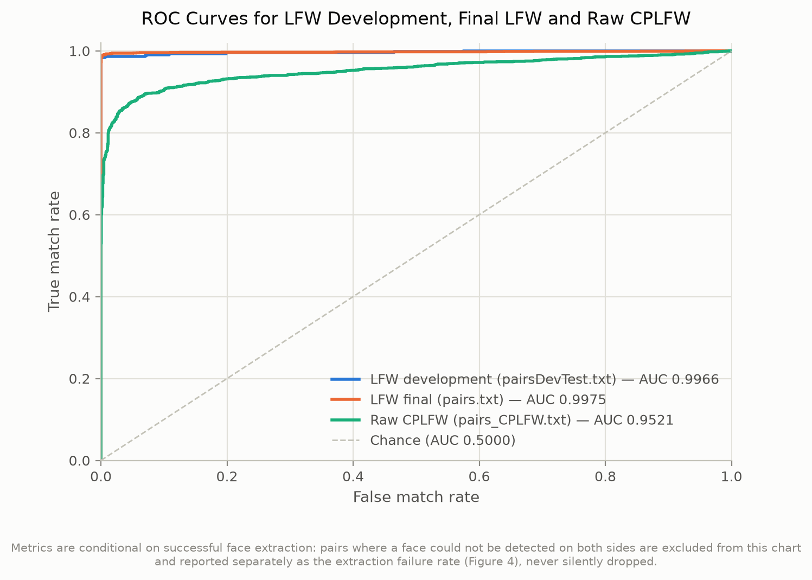
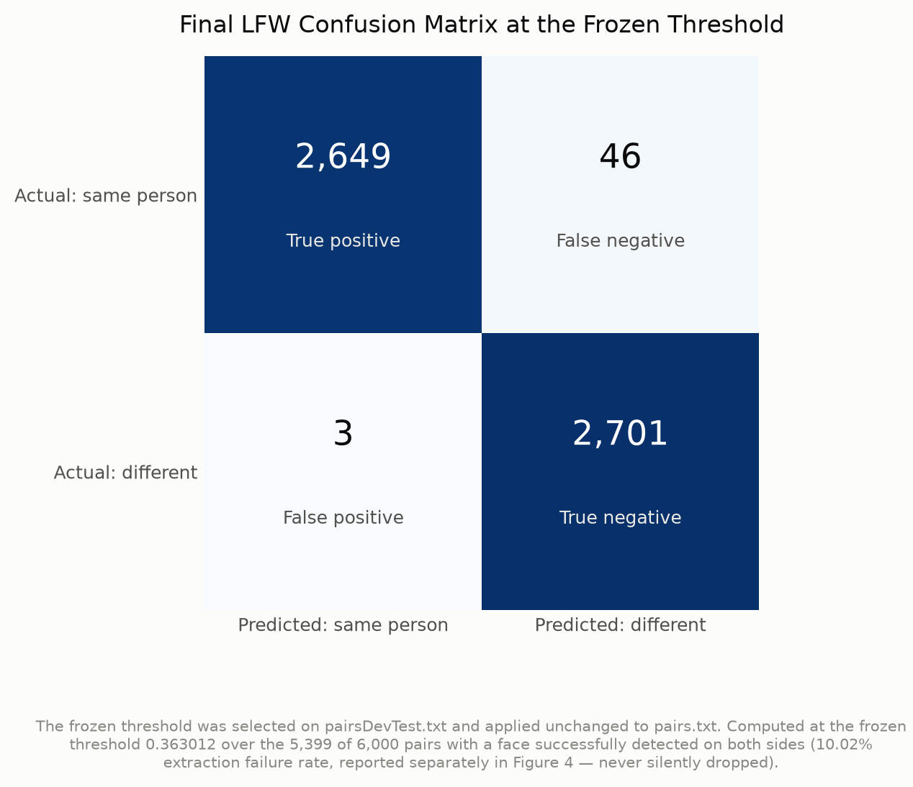
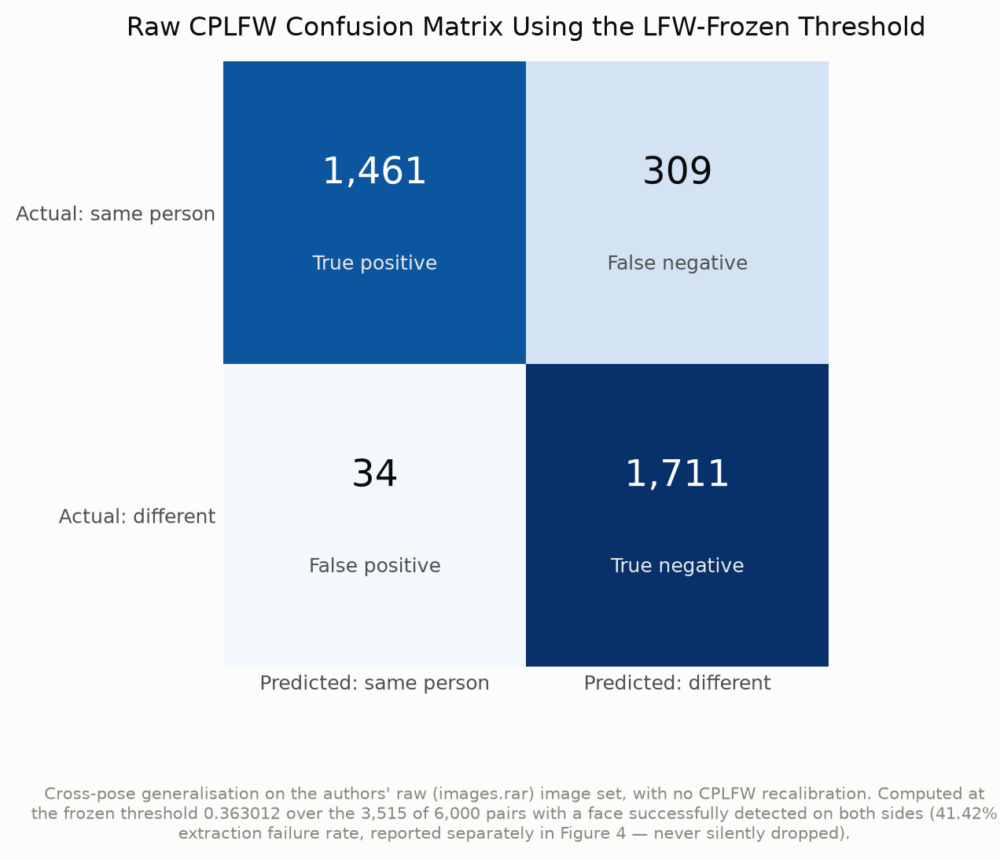
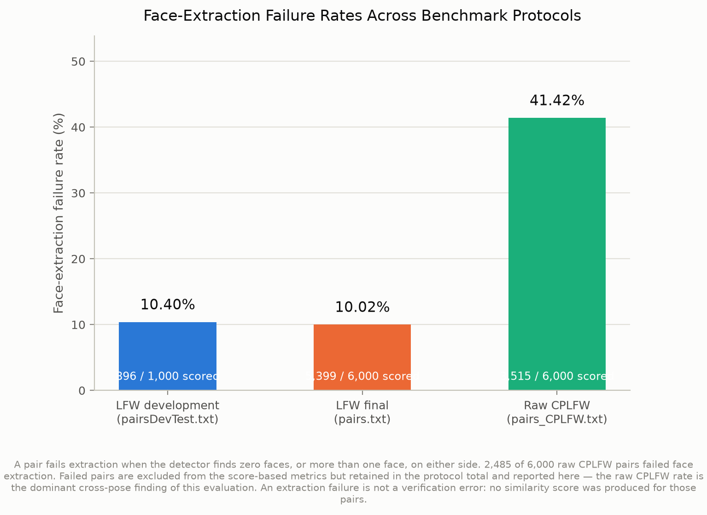
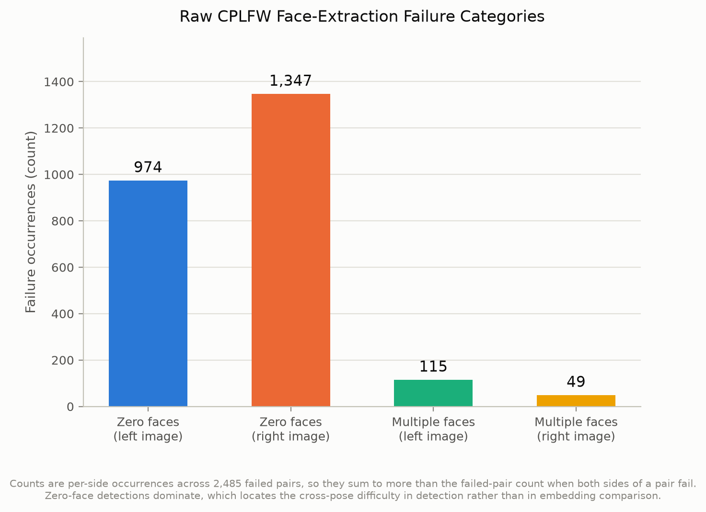
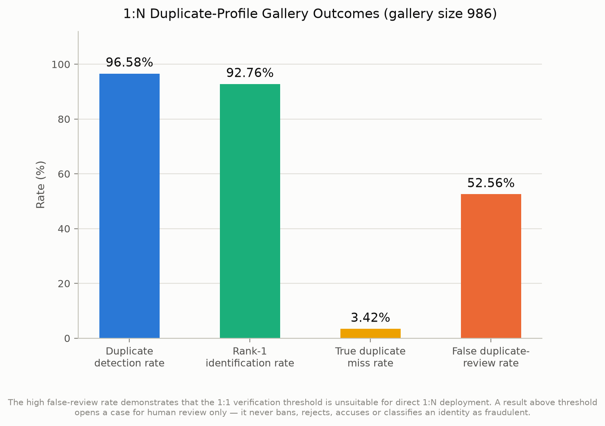
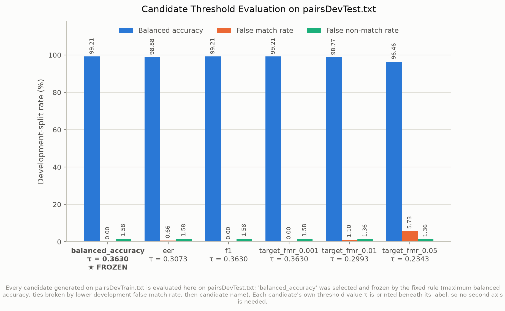
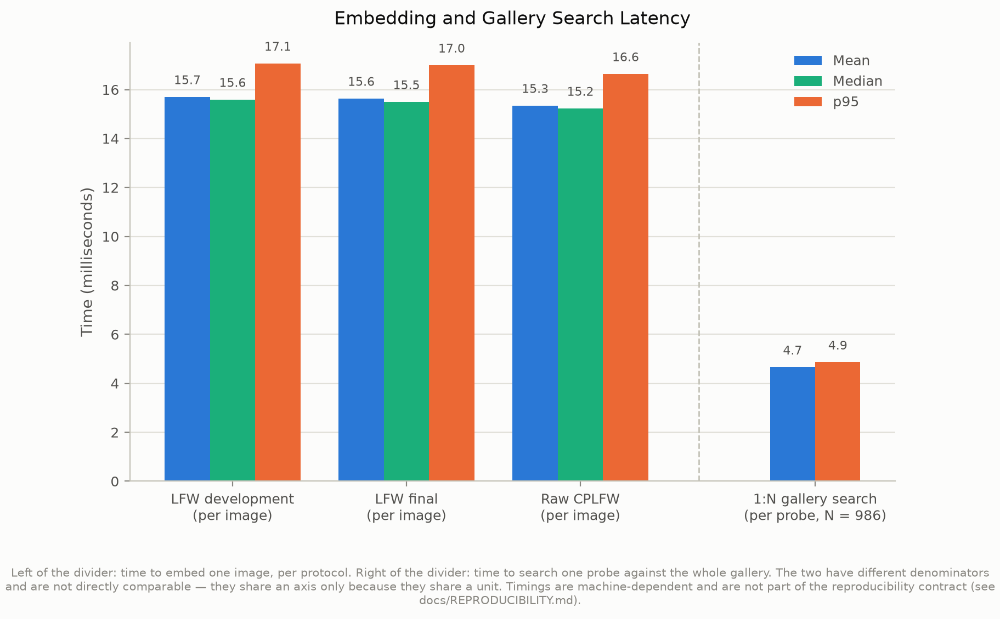
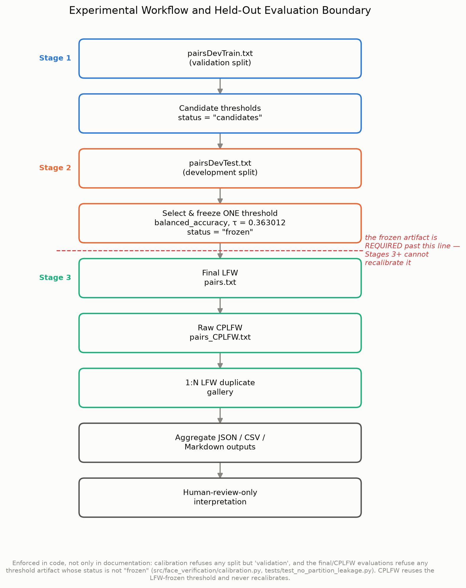

# Results at a glance

A plain-English walkthrough of every figure this project generates. For the full dissertation-grade evidence index (chapter placements, source hashes, privacy flags), see `results/report_evidence/REPORT_EVIDENCE_INDEX.md` instead — this page exists just to make the outcome easy to read at a glance.

**What this project tests.** How well a pretrained face-matching AI can tell whether two photos show the same person, and whether it can spot duplicate profiles in a group of photos — while making sure a match is only ever a prompt for a human to review, never an automatic decision.

## Headline numbers

- **Ordinary photos (LFW):** 99.09% accuracy — a mistake about 1 in 110 of the time.
- **Awkward-angle photos (raw CPLFW):** accuracy drops to 90.24%, and a face couldn't even be detected in 41.42% of attempts — pose is a far bigger obstacle than anything else tested here.
- **Spotting duplicate profiles** in a gallery of 986 people: caught 96.58% of genuine repeats, but also flagged 52.56% of genuinely new people as 'maybe a duplicate' — too many to act on without a human checking.

## Figure 1 — How reliable is the matching, overall?

This is an ROC curve: it shows the trade-off between catching real matches and raising false alarms as the matching rule is made stricter or looser. A line that hugs the top-left corner means the system rarely has to choose between the two. All three lines sit close to that corner — the system is generally reliable — but the raw CPLFW line (awkward-angle photos) sits a little lower, confirming cross-pose photos are the harder case (AUC 0.9521 vs 0.9975 on ordinary photos; 1.0 would be perfect).

## Figure 2 — Final LFW result, in detail

Every pair of photos the system successfully processed lands in one of four boxes: correctly said 'same person', correctly said 'different people', wrongly said 'same' when they weren't (a false match, 0.11% of the time), or wrongly said 'different' when they were the same (a missed match, 1.71% of the time). Almost every pair here lands in one of the two 'correct' boxes.

## Figure 3 — The harder test, in detail

The same kind of chart as Figure 2, but for the awkward-angle photos. There are visibly more mistakes here, and specifically more missed matches (17.46%) than false alarms (1.95%) — when the system gets confused by pose, it tends to err on the side of saying two photos of the same person look different, not the other way round.

## Figure 4 — Before comparing faces, can it even find one?

Before two photos can be compared, the system first has to locate a face in each one — that step alone can fail. On ordinary photos it fails about 10.02% of the time; on the awkward-angle photos it fails 41.42% of the time — nearly half of those pairs never even reach the comparison stage. This is reported openly rather than quietly dropped, because ignoring it would make the accuracy numbers look better than they really are.

## Figure 5 — Why detection fails on awkward-angle photos

Zooming into *why* detection failed: overwhelmingly, no face at all could be found (974 + 1,347 cases), rather than the detector finding too many faces (115 + 49 cases). That points squarely at the sharp camera angles being the obstacle, not photo quality or crowding.

## Figure 6 — Finding duplicate profiles in a crowd

Simulates a real gallery of 986 people and asks, for each new photo, 'has this exact face appeared before?'. The system correctly caught 96.58% of genuine repeat appearances, but also raised a false alarm on 52.56% of genuinely new people. That's why this project's rule is: a flagged result opens a case for a **human** to review — it never bans, blocks or accuses anyone automatically.

## Figure 7 — How the matching threshold was chosen

There's no single 'correct' setting for how similar two faces must look before counting them as a match — it's a dial. This chart compares several candidate settings, each tried out on a held-back set of practice photos never used for the real results above, with the one actually chosen ('balanced_accuracy') marked with a star. Choosing it this way, before ever looking at the final test photos, is what makes the headline numbers a fair test rather than a tuned-up one.

## Figure 8 — How fast is it?

On average, processing one photo takes about 16 milliseconds (roughly 64 photos a second); searching the whole 986-person gallery for a match takes about 4.7 milliseconds per search. These numbers depend on the machine they were measured on, so they're a feasibility indicator, not a formal benchmark.

## Figure 9 — How the whole experiment was run

A step-by-step map of the whole pipeline, showing that the matching threshold was locked in using only practice data, *before* it was ever applied to the real final photos or the awkward-angle photos — so nothing downstream of that line was tuned to get a good score.

## Bottom line

- On ordinary photos, the matching is very reliable (99.09%).
- On awkward-angle photos, detecting a face at all is the main bottleneck, not the matching itself — worth fixing first in any follow-on work.
- For duplicate-profile search, this pipeline is good at catching real repeats but flags too many innocent people to act on automatically — hence the human-review-only policy running throughout this project.
